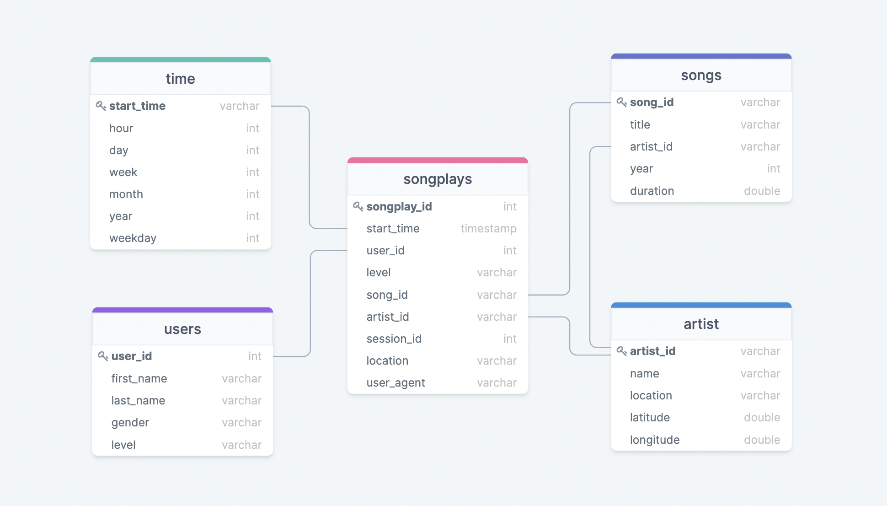

# Table of contents
1. [About The Project](#About_The_Project)
2. [How To Run The Scripts](#Run_Scripts)
3. [Project Files](#Project_Files)
4. [Database Schema](#Database_Schema)
5. [ETL Pipeline](#ETL_Pipeline)


### About The Project <a name="About_The_Project"></a>

The Sparkify database created in this project contains data related to songs and user activity extracted from log files through ETL pipelines. The tables are designed to optimize queries on song play analysis and help the analytics team find out what songs users listen to.


### HOW TO RUN THE SCRIPTS <a name="Run_Scripts"></a>

1. Run create_tables.py from the terminal to create the database
   ```sh
   python create_tables.py
   ```
  
2. Run etl.py from the terminal to populate the database
   ```sh
   python etl.py
   ```


### Project Files <a name="Project_Files"></a>

1. test.ipynb displays the first few rows of each table and contains some basic tests to evaluate the database creation.

2. create_tables.py drops and creates the tables. Run this file to reset the tables before each time you run the ETL scripts.

3. etl.ipynb reads and processes a single file from song_data and log_data and loads the data into the tables. This notebook contains detailed instructions on the ETL process for each of the tables.

4. etl.py reads and processes files from song_data and log_data and loads them into the tables.

5. sql_queries.py contains all the sql queries, and is imported into the last three files above.

6. the log files related to songs and user activity are in data folder.

7. README.md file.


### Database Schema <a name="Database_Schema"></a>

The following entity-relationship diagram shows a star schema optimized for queries created using the Sparkify database. 



### ETL Pipeline <a name="ETL_Pipeline"></a>

Reads and processes files from song_data and log_data in the data folder and loads them into the tables.
